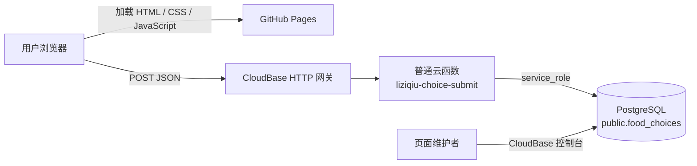
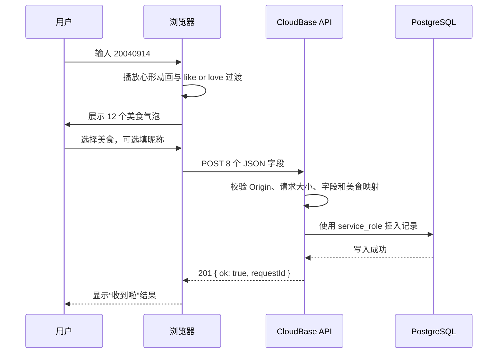

# 系统架构

Like or Love 由一个纯静态前端和一个最小化写入后端组成。前端托管在 GitHub Pages；CloudBase HTTP 网关把选择请求转发给普通云函数；云函数校验请求后写入 PostgreSQL。

## 组件关系



| 组件 | 职责 | 不包含的敏感信息 |
| --- | --- | --- |
| GitHub Pages | 展示口令页、心形过渡、美食气泡和结果状态 | CloudBase API Key、数据库密码、腾讯云密钥 |
| `config.js` | 提供公开的 HTTPS 接口地址和演示模式开关 | 任何服务端凭据 |
| HTTP 网关 | 把公开路由转发到普通云函数 | 业务数据校验逻辑 |
| 普通云函数 | 校验来源、方法、请求体和全部字段，并执行数据库写入 | 不向响应或日志输出凭据与数据库错误详情 |
| PostgreSQL | 保存选择；通过约束、唯一索引、RLS 和角色权限提供最后一层校验 | 不向浏览器直接开放写权限 |

## 页面流程



口令检查完全发生在浏览器端。口令 `20040914` 能从静态源代码中读取，因此只控制页面展示流程，不构成安全边界。

## 请求格式

前端向 [`config.js`](../config.js) 指定的 HTTPS 地址发送 `application/json`：

```json
{
  "food_id": "hotpot",
  "food": "火锅",
  "nickname": "栗子球",
  "visitor_id": "m1234567-abcd1234",
  "request_id": "m1234567-efgh5678",
  "client_time": "2026-09-23T12:00:00.000Z",
  "source": "github-pages",
  "page_version": "2.0"
}
```

云函数要求对象恰好包含这 8 个字段，并检查：

- `food_id` 与 `food` 必须匹配预设的 12 组美食；
- 昵称不能含首尾空白，最长 20 个 Unicode 字符，且不能含控制字符；
- 访客编号和请求编号仅含小写字母、数字和连字符，最长 80 个字符；
- 客户端时间必须是有效的 UTC ISO 时间；
- 来源和页面版本必须分别为 `github-pages` 与 `2.0`；
- 解码后的请求体不能超过 4096 字节。

成功时返回 HTTP `201` 和 `{ "ok": true, "requestId": "..." }`。响应不会包含数据库或 SDK 错误详情。

## 本地演示路径

满足下列任一条件时，前端不会请求 CloudBase：

- 使用 `file:` 打开页面；
- 主机名为 `localhost` 或 `127.0.0.1`；
- URL 查询参数包含 `demo=1`；
- `config.js` 将 `demoMode` 设为 `true`。

这时最近 30 条记录保存在当前浏览器的 `localStorage` 键 `liziqiu-demo-choices` 中。匿名设备编号保存在 `liziqiu-visitor-id` 中。

## 信任边界与防护

### 浏览器端

- 静态页面和公开 API 地址都可以被查看与修改，不能作为身份认证依据。
- HTTPS 用于保护传输过程；前端不会携带 Cookie 或服务端密钥。
- 12 秒超时和明确的失败状态避免把未知响应显示为保存成功。

### 云函数

- 只为 `https://tengyuew7-ops.github.io` 返回跨域许可，并自行处理 `OPTIONS`。
- 仅接受 JSON `POST`；`GET` 用于健康检查，其他方法返回 `405`。
- 在数据库写入前执行严格字段和允许列表校验。
- `CLOUDBASE_APIKEY` 由 CloudBase 运行时注入，应用不会把它写入代码包、响应或日志。

CORS 是浏览器约束，不等同于调用方身份认证。若以后需要防止第三方脚本或非浏览器客户端提交，应增加服务端鉴权、速率限制或一次性签名。

### 数据库

- `anon` 与 `authenticated` 角色没有表和序列权限；
- 只有服务端 `service_role` 可以插入；
- 唯一 `request_id` 防止同一请求被重复保存；
- 检查约束再次限制字段长度、来源和美食映射；
- 时间索引用于按最新提交查看记录。

## 部署与变更

前端发布和后端发布相互独立：

1. `main` 分支中的静态文件由 GitHub Pages 发布。
2. [`backend/cloudbase/function`](../backend/cloudbase/function/) 作为普通云函数代码包部署。
3. [`backend/cloudbase/schema.sql`](../backend/cloudbase/schema.sql) 在 CloudBase PostgreSQL SQL 编辑器中执行，脚本可重复运行且保留现有记录。
4. HTTP 网关的 `/liziqiu-choice` 路由指向云函数。
5. [`config.js`](../config.js) 保存公开网关地址。

具体控制台步骤见 [CloudBase 配置说明](cloudbase-setup.md)。
